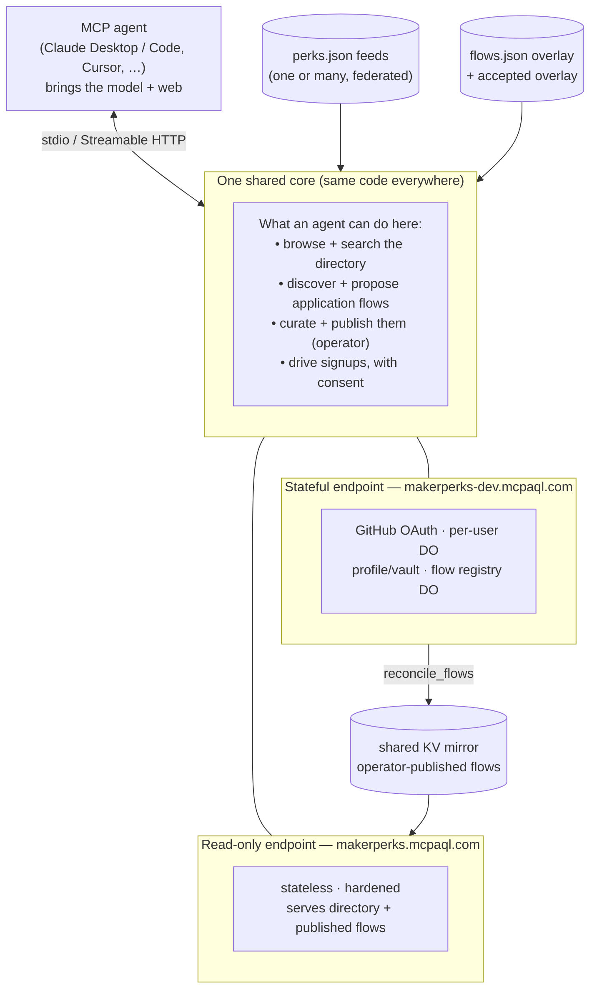

# MakerPerks MCP-AQL Adapter

A native [MCP-AQL](https://github.com/MCPAQL/spec) server over
[MakerPerks](https://github.com/natea/makerperks) — the browseable, agent-friendly
directory of builder perks (free credits, discounts, and programs for startups,
students, OSS maintainers, indie devs, and non-profits).

It speaks **MCP-AQL**: instead of registering a separate MCP tool for every query and
action, the server exposes a small set of **semantic verbs** — *read · create · update ·
delete · execute* (~120 tokens each) — and the agent discovers the operations behind them
**at runtime** via introspection. So an agent's tool-registration cost stays nearly flat
even as the number of operations grows past 30 — a fraction of a conventional "a tool per
operation" server. (The public endpoint is **read-only** — just the read verb; the full
server exposes all five.)

Beyond reading, the adapter is a **substrate for action and curation**: agents discover
and propose application *flows*, an **operator** accepts them, the directory federates
**many** opportunity feeds, and the server can **produce** feeds too — all under a
zero-trust model where the server never acts on anyone's behalf.

## System at a glance

**In the picture:**

- **MCP agent** — your client (Claude Desktop / Code, Cursor, …). It brings the model and
  any web access; the adapter brings the directory, the tools, and the guardrails.
- **The core** — one request router. The *same* code runs three ways: local **stdio** (a
  personal tool), the public **read-only** Worker, and the **stateful** Worker (per-user
  GitHub login + Durable Objects).
- **Read-only endpoint** (`makerperks.mcpaql.com`) — public, no login, stateless and
  hardened. Serves the directory and any flows an operator has published.
- **Stateful endpoint** (`makerperks-dev.mcpaql.com`) — per-user GitHub login, a per-user
  profile + encrypted credential vault, the shared flow registry, and operator-gated
  curation.
- **Feeds → flows → KV mirror** — the data: one or many opportunity feeds federated into
  the directory; a curated *flows* overlay (how to actually apply); and a shared mirror
  that pushes operator-blessed flows to the public endpoint with no redeploy.

**What makes it unique:**

- **A near-flat tool cost** — a few semantic verbs + runtime discovery, so an agent's setup
  cost barely grows as the operation count does.
- **Model-agnostic flow discovery** — the server hands a connected agent a research
  scaffold and the safety gates; the *agent* supplies the intelligence. No model or
  provider SDK is baked in.
- **Zero-trust curation** — anyone may propose, only an operator accepts and publishes, and
  the server itself never writes anything outbound (no PRs, no stored write-credentials).
- **A federating, producing substrate** — point it at many feeds (perks, grants, programs,
  camping slots, …); it can also *generate* a feed of its own, which round-trips back in as
  a source.
- **One core, three deployments** — personal tool, public read-only, and full stateful,
  from the same code.

## Connect

- **Hosted (zero install):** add **`https://makerperks.mcpaql.com`** as a remote MCP
  connector (claude.ai, Claude Code, Cursor, …). OAuth registers automatically.
- **Local (stdio):** `npm install && npm run build`, then point your MCP client at
  `node dist/index.js`.
- **Your own directory:** run it locally or self-host it and point it at **your own** feed(s)
  (`perks.json`, `grants.json`, …) — see **[`docs/INSTALL.md`](docs/INSTALL.md)**.

Then call `mcp_aql_read` with `{ "operation": "introspect" }` to discover the operations.

## What it does

- **Read** the directory — `list_programs` / `get_program` / `search_programs` /
  `get_application_flow`, carrying decision signal (value, audience, eligibility,
  verified date, redemption URL) so an agent decides without a second call.
- **Discover & propose flows** — a model-agnostic toolkit (`get_discovery_brief` →
  `verify_flow_proposal` → `propose_flow`) a connected agent drives to turn a bare perk
  into an automatable, verified application *flow*. The server supplies the scaffold and
  the gates; the agent brings the model and the web.
- **Curate (operator-gated)** — users are untrusted and may only propose; a configured
  **operator** accepts flows into the served set and `reconcile_flows` publishes them to
  the public endpoint. The server holds no write credentials and opens no PRs.
- **Federate & produce** — ingest one or **many** `perks.json`-shaped feeds (perks /
  grants / college programs / camping slots …) into one directory, and emit a
  schema-valid feed of its own (`export_perks`) — a general opportunity-directory
  substrate, not just a MakerPerks app.
- **Act on your behalf — with consent** — for programs that have an API, the adapter can
  drive the actual signup: it assembles the application from your saved profile and an
  encrypted credential vault, then submits it step by step under an **autonomy switch you
  control** — *review every step*, *auto-submit low-risk steps*, or *full-auto within
  limits*. It pauses for your approval before anything sensitive, routes payment /
  real-identity steps to an out-of-band check, and never claims eligibility you don't have.
  Programs with no API are handed off to an external browser-automation agent with
  everything pre-filled.

## Status

Everything described above is **built, tested, and deployed** — browsing and search, the
discover-and-propose flow toolkit, operator-gated curation, multi-feed federation, feed
production, and the consent-based signup pipeline (profile + encrypted vault + autonomy
switch). Two endpoints are live:

- **Read-only (public, no login):** `https://makerperks.mcpaql.com`
- **Stateful (per-user GitHub login):** `https://makerperks-dev.mcpaql.com`

Every capability is specified and validated under [`openspec/specs/`](openspec/specs/), with
200+ automated tests passing. **Still ahead:** broader provider coverage, a contribution
pipeline back to the upstream directory, and anti-abuse limits — see
[`docs/ROADMAP.md`](docs/ROADMAP.md) for the full plan.

## Documentation

- [`docs/INSTALL.md`](docs/INSTALL.md) — install + point it at your own feed(s) + self-hosting
- [`docs/ARCHITECTURE.md`](docs/ARCHITECTURE.md) — system model, the capability map, and
  diagrams (flow lifecycle, federation, the trust boundary)
- [`docs/flows-roundtrip.md`](docs/flows-roundtrip.md) — the flows.json round-trip + the
  operator publish/contribute workflow
- [`docs/ROADMAP.md`](docs/ROADMAP.md) — the staged plan and status
- [`CLAUDE.md`](CLAUDE.md) — project configuration & conventions
- [`openspec/specs/`](openspec/specs/) — the spec baseline (every capability, with
  requirements + scenarios)

## License

Code & schemas: AGPL-3.0 (commercial tiers available, like the rest of the MCP-AQL
org). Docs: CC BY 4.0. The directory **data** is MIT (MakerPerks); only MIT-safe data
crosses back to the upstream directory — no AGPL code does. The AGPL covers the engine,
not the feeds it reads or emits — see [`LICENSING.md`](LICENSING.md) for the full data
boundary.
