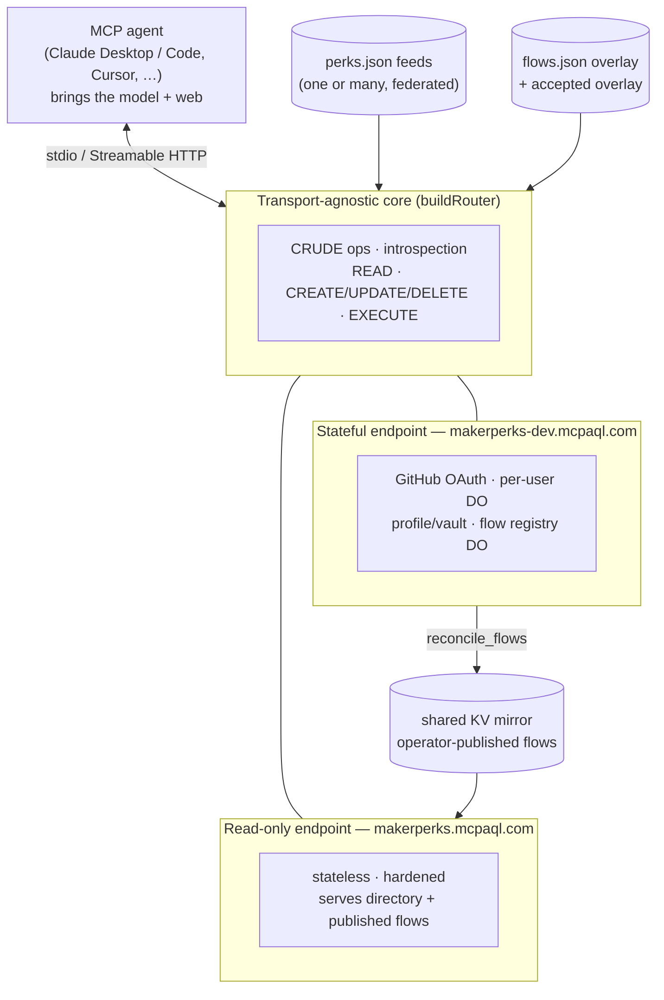

# MakerPerks MCP-AQL Adapter

A native [MCP-AQL](https://github.com/MCPAQL/spec) server over
[MakerPerks](https://github.com/natea/makerperks) — the browseable, agent-friendly
directory of builder perks (free credits, discounts, and programs for startups,
students, OSS maintainers, indie devs, and non-profits).

It exposes the **whole** directory to an AI agent through **one token-cheap semantic
tool** per CRUDE verb (e.g. `mcp_aql_read`, **~120 tokens**) instead of a wall of
discrete MCP tools — the operations are discovered at runtime via introspection. That's
~95%+ fewer tool-registration tokens than a conventional "a tool per query" server.

Beyond reading, the adapter is a **substrate for action and curation**: agents discover
and propose application *flows*, an **operator** accepts them, the directory federates
**many** opportunity feeds, and the server can **produce** feeds too — all under a
zero-trust trust model where the server never acts on anyone's behalf.

## System at a glance

The same core runs three ways: **local stdio** (a personal tool), the **read-only**
public Worker, and the **stateful** Worker (real per-user OAuth, Durable Objects).

## Connect

- **Hosted (zero install):** add **`https://makerperks.mcpaql.com`** as a remote MCP
  connector (claude.ai, Claude Code, Cursor, …). OAuth registers automatically.
- **Local (stdio):** `npm install && npm run build`, then point your MCP client at
  `node dist/index.js`.
- **Your own directory:** run it locally or self-host it and point it at **your own** feed(s)
  (`perks.json`, `grants.json`, …) — see **[`docs/INSTALL.md`](docs/INSTALL.md)**.

Then call `mcp_aql_read` with `{ "operation": "introspect" }` to discover the operations.

## What it does

- **Read** the directory — `list_programs` / `get_program` / `search_programs` /
  `get_application_flow`, carrying decision signal (value, audience, eligibility,
  verified date, redemption URL) so an agent decides without a second call.
- **Discover & propose flows** — a model-agnostic toolkit (`get_discovery_brief` →
  `verify_flow_proposal` → `propose_flow`) a connected agent drives to turn a bare perk
  into an automatable, verified application *flow*. The server supplies the scaffold and
  the gates; the agent brings the model and the web.
- **Curate (operator-gated)** — users are untrusted and may only propose; a configured
  **operator** accepts flows into the served set and `reconcile_flows` publishes them to
  the public endpoint. The server holds no write credentials and opens no PRs.
- **Federate & produce** — ingest one or **many** `perks.json`-shaped feeds (perks /
  grants / college programs / camping slots …) into one directory, and emit a
  schema-valid feed of its own (`export_perks`) — a general opportunity-directory
  substrate, not just a MakerPerks app.
- **Act (Stage 1)** — an EXECUTE pipeline drives real perk signups under a user-controlled
  autonomy switch, with a per-user profile + encrypted credential vault.

## Status

The directory + dual transport + Cloudflare hosting + OAuth, the Stage-1 application
pipeline + autonomy switch + profile/vault, and the Stage-2 flow arc (documents,
discovery, acceptance, health, directory-status) are **done and archived**
(`openspec/specs/`). The **portable-data epic** (multi-source federation, the operator
trust model, flow/perks export, and reconcile-to-public) is **complete and deployed**.

- **Live (read-only):** `https://makerperks.mcpaql.com`
- **Live (stateful, per-user OAuth):** `https://makerperks-dev.mcpaql.com`

See [`docs/ROADMAP.md`](docs/ROADMAP.md) for the staged plan and current status.

## Documentation

- [`docs/INSTALL.md`](docs/INSTALL.md) — install + point it at your own feed(s) + self-hosting
- [`docs/ARCHITECTURE.md`](docs/ARCHITECTURE.md) — system model, the capability map, and
  diagrams (flow lifecycle, federation, the trust boundary)
- [`docs/flows-roundtrip.md`](docs/flows-roundtrip.md) — the flows.json round-trip + the
  operator publish/contribute workflow
- [`docs/ROADMAP.md`](docs/ROADMAP.md) — the staged plan and status
- [`CLAUDE.md`](CLAUDE.md) — project configuration & conventions
- [`openspec/specs/`](openspec/specs/) — the spec baseline (every capability, with
  requirements + scenarios)

## License

Code & schemas: AGPL-3.0 (commercial tiers available, like the rest of the MCP-AQL
org). Docs: CC BY 4.0. The directory **data** is MIT (MakerPerks); only MIT-safe data
crosses back to the upstream directory — no AGPL code does. The AGPL covers the engine,
not the feeds it reads or emits — see [`LICENSING.md`](LICENSING.md) for the full data
boundary.
