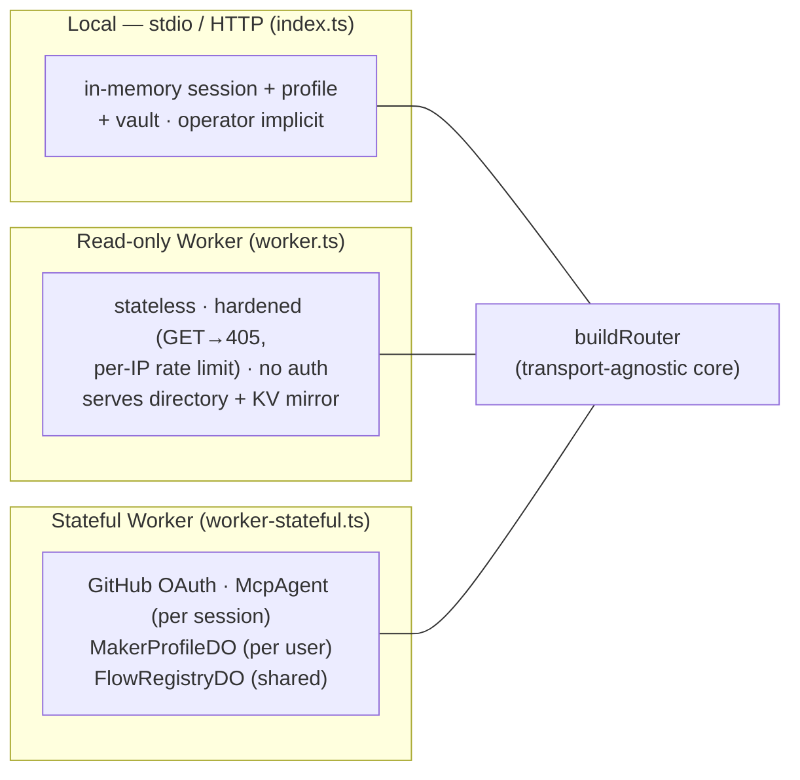
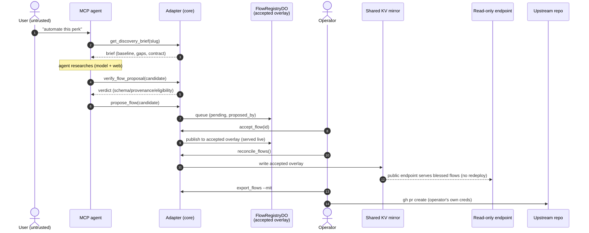
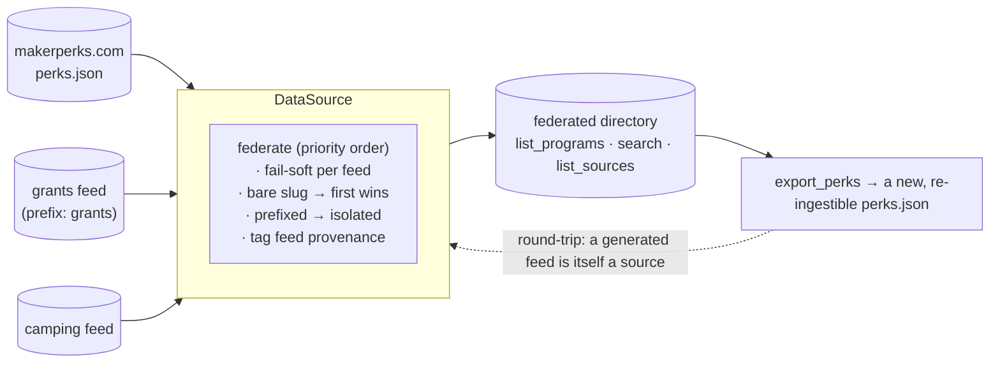
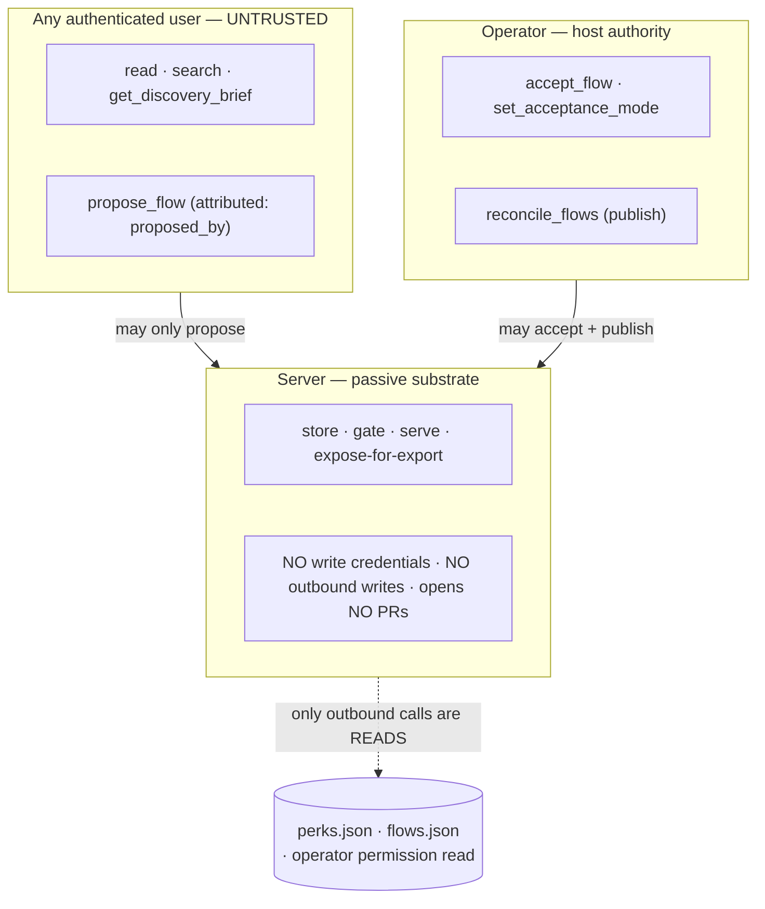

# Architecture

The system model and the MCP-AQL primitives this adapter depends on. For *what we build
when*, see [`ROADMAP.md`](ROADMAP.md). Normative protocol details live in the
[MCP-AQL spec](https://github.com/MCPAQL/spec); **DollhouseMCP** is the reference native
MCP-AQL server.

> **As-built (2026-06).** Stage 0 (read), Stage 1 (application pipeline + autonomy +
> profile/vault), the Stage-2 flow arc (documents, health, discovery, acceptance,
> directory-status), and the portable-data epic (federation, operator model, export,
> reconcile) are all implemented, archived under `openspec/specs/`, and deployed.

## 1. What the adapter is

Four things, layered, sharing one core:

1. **Read** — a CRUDE **READ** family over the directory (`list_programs`, `get_program`,
   `search_programs`, `get_application_flow`, `list_sources`, `introspect`). Stateless;
   the token-efficiency win and the foundation everything sits on.
2. **Discover & propose flows** — a **model-agnostic toolkit** (`get_discovery_brief` →
   `verify_flow_proposal` → `diff_flow_proposal` → `propose_flow`) a connected agent
   drives to turn a bare perk into a verified, automatable application *flow*. The server
   supplies the scaffold + the model-free gates (schema / provenance / eligibility); the
   agent brings the model + web. No provider SDK is a dependency.
3. **Curate & publish (operator-gated)** — the proposed-flow review queue + acceptance
   dial (`accept_flow`, `set_acceptance_mode`), and `reconcile_flows` to publish accepted
   flows to the public endpoint. Plus federation + production of `perks.json` feeds.
4. **Act** — drive the actual signup under a user-controlled autonomy switch, assembling
   from a per-user profile + encrypted credential vault. An **EXECUTE** pipeline
   (`start_application` → `submit_step`) submits API-based flows directly (inspected via the
   READ ops `get_status` / `get_handoff`);
   for a flow with **no API**, the adapter supplies the discovered flow + assembled
   application and the **connected agent** completes it with its own browser automation
   (computer-use / browser-use) under the same guardrails — or, if the agent can't drive a
   browser, a ready-to-finish prepared handoff. The adapter never runs a browser itself; it
   provides the flow, the data, and the safety rails — the agent does the doing.

## 2. One core, three deployments

The load-bearing structural rule: a **transport-agnostic request core** (`buildRouter`)
with **thin transport bindings**. The core parses `{ operation, params }` → routes →
validates params (reject unknown → `VALIDATION_UNKNOWN_PARAM`) → returns the discriminated
`{ success, data | error }` wire format. It imports no transport API and holds no
transport-global state, so the *same* router runs three ways:

- **stdio** (`StdioServerTransport`) — local add-to-client; the personal-tool mode (the
  lone user is implicitly the operator; profile/vault live on-device).
- **Streamable HTTP** (`StreamableHTTPServerTransport`) — single endpoint, POST + optional
  SSE, sessions via `Mcp-Session-Id`. Not the deprecated HTTP+SSE dual-endpoint transport.
- **Cloudflare Workers** — web-standard Streamable HTTP. The read-only Worker is stateless
  (a fresh server+transport per request); the stateful Worker uses **Durable Objects** —
  an `McpAgent` per session, a `MakerProfileDO` per user (profile/vault/audit/flowHealth/
  statusPolicy — structurally isolated), and one shared `FlowRegistryDO` (the proposal
  queue + accepted overlay + acceptance dial).

Two edge constraints, both handled everywhere: **no `eval`/`new Function`** (so validators
are eval-free, not `ajv`), and **wrap `fetch`** (a detached global `fetch` throws on
Workers).

## 3. The capability map

Each capability is an archived OpenSpec spec (`openspec/specs/<name>`) with requirements +
scenarios. Grouped by layer:

| Layer | Capabilities |
|---|---|
| **Core / transport** | `server-transport`, `directory-query`, `hosted-endpoint`, `endpoint-auth`, `stateful-session` |
| **Directory data** | `data-source`, `directory-status`, **`directory-federation`** (multi-source), **`perks-export`** (produce) |
| **Flows** | `application-flows`, `flow-documents`, `flow-health`, `flow-discovery`, `flow-acceptance`, **`flow-export`**, **`flow-reconcile`** |
| **Curation / trust** | **`operator-authorization`** (zero-trust gate) |
| **Action (Stage 1)** | `application-pipeline`, `autonomy-switch`, `maker-profile`, `credential-vault`, `web-handoff` |

## 4. The flow lifecycle

How a bare perk becomes an automatable, published, contributable flow. Discovery is
model-agnostic (the agent supplies intelligence); acceptance and publishing are
operator-gated; the upstream PR is run by the operator, never the server.

Key invariant: **the server never initiates a state-changing outbound call.** Every
mutation is a principal acting under their own authority; the only outbound calls are
reads. The KV write is internal; the PR is the operator's own `gh`.

## 5. Directory federation

The directory generalizes from one `perks.json` to a federation of many — anyone can
publish an opportunity feed. Feeds load in priority order, **fail-soft** (a broken feed is
skipped + surfaced, never fatal), with **priority dedupe** on bare slugs and an **opt-in
prefix** for feeds that want isolation. Each program is tagged with server-set `feed`
provenance; `list_sources` surfaces per-feed health.

The primary feed stays **bare**, so slug-keyed overlays (`flows.json`, the accepted
overlay, discovery) are unaffected. A server-generated feed (`export_perks`) is itself an
ingestable source — the producer/consumer round-trip closes.

## 6. The trust boundary (zero-trust)

The adapter is hosted, multi-user infrastructure, so it treats every user as untrusted.

**Operator identity** is host-configured (the host picks, both can be set):
- **A — GitHub-native** (`OPERATOR_REPO`): operator = admin on a governing repo, checked
  with the *user's own* OAuth token (a read); only a boolean is persisted, no token at rest.
- **B — allowlist** (`OPERATOR_LOGINS`): operator = login in the list; zero outbound calls.
- **Local/stdio:** the lone user is implicitly the operator. **Hosted-with-neither:** fails
  safe (no operators).

## 7. MCP-AQL primitives we rely on

| Primitive | What it gives us |
|---|---|
| **CRUDE endpoints** | Many tools collapse into a few semantic verbs (READ / CREATE / UPDATE / DELETE / EXECUTE) |
| **Mandatory introspection** | Runtime discovery of operations/params/types — no preloaded tool schemas (the token win) |
| **Discriminated wire format** | Every result is `{ success, data }` or `{ success, error }`; unknown params rejected |
| **EXECUTE lifecycle** | Non-idempotent, stateful application steps (pending→running→completed) |
| **Batch-with-halting** | A sequence that halts at the first confirmation-required step and resumes with a token |
| **Confirmation tokens** | Session-scoped, single-use, time-limited, param-bound approval for gated steps |
| **Danger levels (0–4) + trust** | Classify each step's risk; the autonomy switch is a threshold over these |
| **Execution Safety Loop** | Agent reports each intended action → `AutonomyDirective`; pause/escalate |
| **Challenge-Response** | Out-of-band code (the LLM can't see it) for the highest-risk actions |

The autonomy switch is **not new machinery** — a configured danger threshold enforced by
the confirmation + Execution Safety Loop primitives. The acceptance dial is the operator's
analogous pre-authorization for auto-accepting low-danger proposals.

## 8. Data source & license boundary

The adapter loads **published** `perks.json` feed(s), validates each with a small
**eval-free** payload checker (not `ajv`), holds them in memory, and refreshes
(trigger + TTL). It never reads upstream source content, forks the data, or writes back
through code.

- **Boundary:** data (MIT) crosses in; AGPL code never crosses back. A server-generated
  feed or flow extract sent upstream is **MIT-safe data only** (`export-flows.mjs --mit`).
- **Drift safety:** a schema-invalid feed fails loud (single source) or is skipped +
  surfaced (federated), never serving malformed records.
- **Flow precedence:** derived baseline ⊕ `flows.json` overlay ⊕ accepted overlay (the
  registry DO live, or the KV mirror on the read-only endpoint). Accepted wins.

## 9. Security model

Acting on a maker's behalf is the sensitive part:

- **No stored passwords where OAuth / scoped tokens exist.** The per-user **credential
  vault** is AES-256 sealed; on Workers it lives in the per-user `MakerProfileDO`
  (structurally isolated — a session can only ever reach its own user's record), and
  locally in a `0600` keyfile.
- **Per-action approval** governed by the autonomy switch; an **audit log** of every
  mutation; **Challenge-Response** for payment / real-identity steps; never auto-assert
  false eligibility (eligibility is surfaced in `gaps`, never satisfied).
- **The scope boundary, not a payment guarantee:** the core stores no payment credentials
  and drives no payment steps — a scope boundary, not enforcement against externally
  composed tools.
- **The zero-trust invariant** (§6): the server initiates no state-changing outbound call.

## 10. Hosting (as built)

- **Read-only** — `https://makerperks.mcpaql.com` (`worker.ts`): stateless, hardened
  (GET `/` → 405, per-IP rate limit) after the 2026-06-28 KV-overuse incident; OAuth is
  anonymous/auto-approve (client compatibility, not access control — the data is public).
  Serves the directory + the operator-published flows from the KV mirror.
- **Stateful** — `https://makerperks-dev.mcpaql.com` (`worker-stateful.ts`): real per-user
  **GitHub OAuth**, `McpAgent` per session, `MakerProfileDO` per user, the shared
  `FlowRegistryDO`, and the `OVERLAY_KV` mirror. Operator policy + secrets
  (`GITHUB_CLIENT_ID/SECRET`, `VAULT_KEY`) configured on the Worker.
- Both share one `OVERLAY_KV` namespace (the stateful Worker writes via `reconcile_flows`;
  the read-only Worker reads, cached per isolate — no per-request KV storm).
